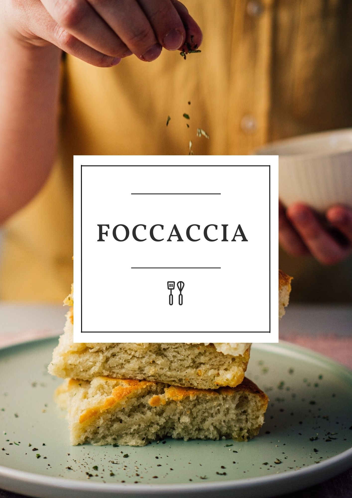

Focaccia is a light, fluffy Italian flatbread bursting with flavor. Our Focaccia is made with a blend of Italian flours, extra virgin olive oil, and sea salt for an irresistibly savory, crispy crust. Topped with fresh rosemary and garlic, it's a delicious accompaniment to any meal.

### Ingredients:

\-3 1/2 cups all-purpose flour 

\-2 tsp active dry yeast 

\-2 tsp salt 

\-1 1/2 cups lukewarm water 

\-3 Tbsp olive oil -

1 Tbsp coarse salt 

\-1 Tbsp rosemary 

### Instructions:

1. In a large bowl, mix together the flour, yeast and salt. 
2. Add the water and olive oil to the dry ingredients and mix until a dough forms. 
3. Knead the dough on a lightly floured surface for about 10 minutes until it is smooth and elastic. 
4. Place the dough in an oiled bowl and cover with a damp towel. Let the dough rise for 1 hour or until it has doubled in size. 
5. Preheat the oven to 425 degrees F. Grease a 10-inch round or 12-inch square baking pan.
6. Punch down the dough and place it in the baking pan. Gently press the dough into the corners of the pan.
7. Make indentations in the dough with your fingertips. Sprinkle the coarse salt and rosemary over the top. 
8. Bake for 20 minutes or until the focaccia is golden brown. 
9. Allow the focaccia to cool before cutting and serving. Enjoy!