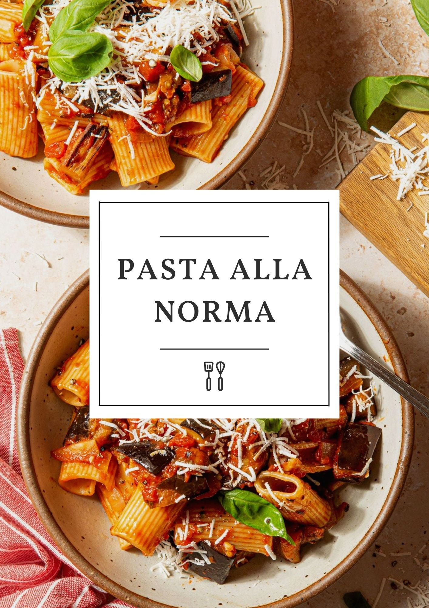

Pasta alla Norma is a classic Sicilian dish that is sure to satisfy. This dish features al dente rigatoni pasta tossed with a rich and flavorful sauce of sautéed eggplant, tomato, garlic and basil, then topped with ricotta salata cheese. Enjoy the unique combination of flavors in this traditional Italian dish!

### Ingredients

\- 1/4 c. extra-virgin olive oil, plus more as needed

\- 1 lb. eggplant, cut into 1-inch cubes

\- Kosher salt

\- 1 lb. rigatoni

\- 1 small yellow onion, chopped

\- 3 cloves garlic, minced

\- 1 tsp. dried oregano

\- 1/4 tsp. red pepper flakes

\- 1 (28-oz.) can crushed tomatoes

\- Freshly ground black pepper

\- Ricotta salata, for serving

\- Basil, for serving

### Method

1. Bring a large pot of salted water to a boil. Add rigatoni and boil until al dente according to box instructions. Reserve 1 cup pasta water, then drain.
2. In another large pot over medium heat, heat oil. Add eggplant, working in batches as necessary to not overcrowd the pan. Cook eggplant until crispy and golden and soft inside, 8 to 10 minutes. Place on a plate to drain and season with salt. Repeat with remaining eggplant, adding more oil as needed. 
3. Drain all but 2 tablespoons of oil from pot or add more oil as needed. Add onion and cook until soft, 5 minutes, then add garlic, oregano, and red pepper flakes and cook until fragrant, 1 minute more. Add crushed tomatoes and bring to a simmer. Season with salt and pepper. Let simmer 10 minutes. 
4. Add pasta and ¼ cup pasta water and toss to coat, then add in eggplant, along with any oil on the plate. Add more pasta water to loosen sauce as needed. 
5. Serve warm with ricotta salata and fresh basil.