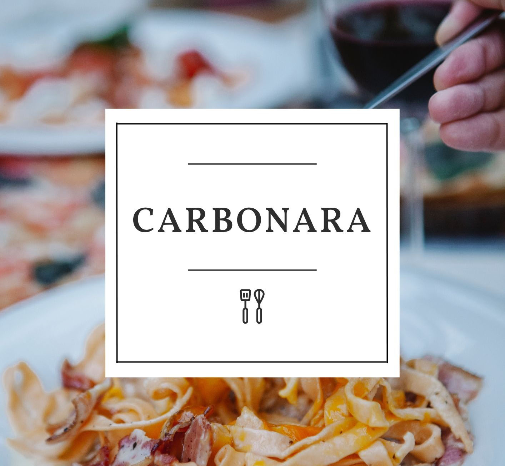

Our Carbonara is a classic Italian dish made with egg, cheese, and bacon. We use a combination of pancetta, pecorino cheese, and a touch of cream to create a rich, creamy sauce that pairs perfectly with al dente spaghetti. Our Carbonara is a flavorful yet simple dish that is sure to please any palate.

## Ingredients:

* 4 large eggs
* 4 ounces pancetta, diced
* 4 ouces guanciale, diced
* 1/4 freshly grated Parmesan cheese
* 1 tablespoon freshly chopped parsley
* 1 teaspoon freshly cracked black pepper
* 1 pound dried spaghetti
* 2 cloves garlic, minced
* 2 tablespoons olive oil

## Method:

1. Bring a large pot of salted water to a boil. Add the spaghetti and cook according to package instructions. 
2. Meanwhile, heat the olive oil in a large skillet over medium heat. Add the garlic and cook for 1 minute. 
3. Add the diced pancetta and guanciale and cook until the fat has rendered and the meat is lightly browned, about 8 minutes. 
4. In a separate bowl, whisk together the eggs, Parmesan cheese, parsley, and black pepper. 
5. When the spaghetti is done, reserve a few tablespoons of the cooking liquid and drain the pasta. 
6. Add the drained pasta to the skillet with the pancetta and guanciale, and toss to combine. 
7. Pour the egg mixture over the pasta and toss to combine. The heat from the pasta will cook the eggs. 
8. If the pasta seems dry, add a few tablespoons of the cooking liquid to loosen it up. 
9. Serve the spaghetti carbonara immediately, with extra Parmesan cheese if desired. Enjoy!