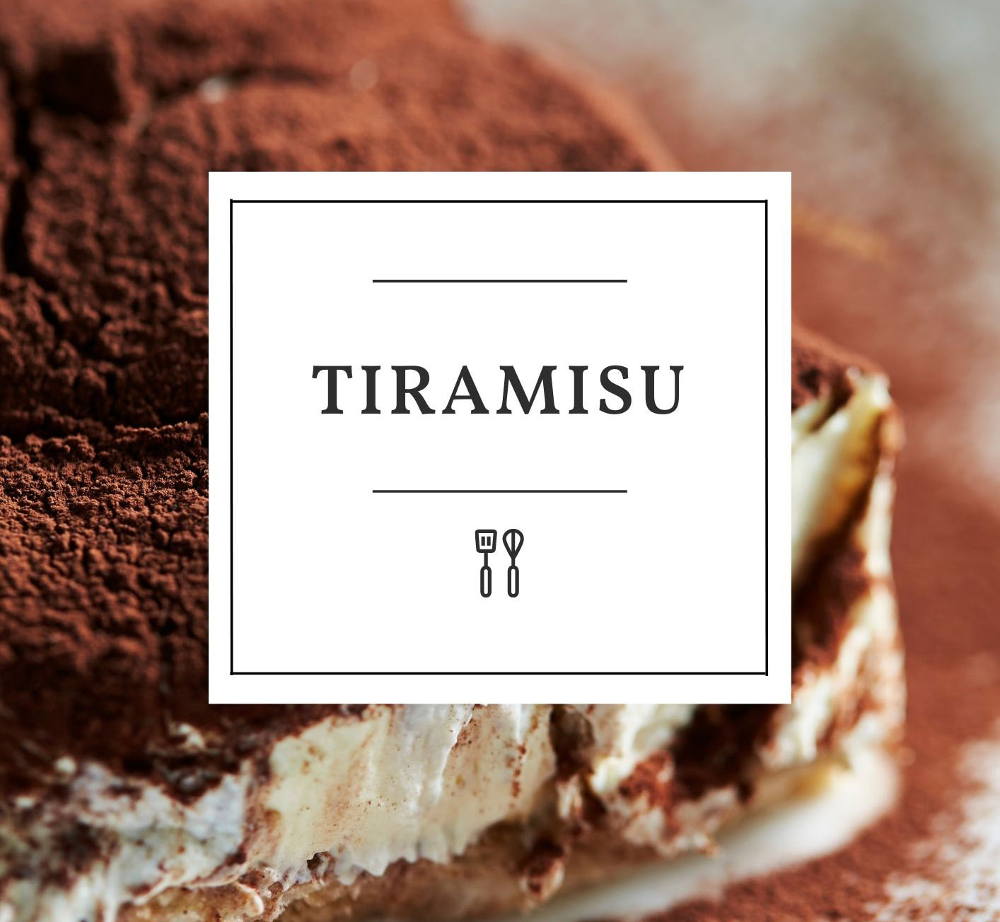

A combination of creamy, sweet flavors with layers of coffee-soaked ladyfingers, rich mascarpone cheese, and cocoa powder give it a unique and delicious flavor that is hard to beat. The creamy, light texture of the mascarpone cheese pairs perfectly with the coffee-soaked ladyfingers, creating a perfect balance of flavors. Topped with cocoa powder, which gives it an additional layer of sweetness.

## Ingredients:

* 6 large egg yolks
* 1/2 cup sugar
* 1/2 cup mascarpone cheese
* 1/4 cup sweet Marsala wine
* 1/4 cup heavy cream
* 2 tbsp powdered sugar
* 1 tsp lemon zest
* 1/2 tsp espresso or strong coffee
* 1/2 crushed Italian ladyfingers
* 2 tbsp cocoa powder

## Instructions:

1. Preheat the oven to 350°F (175°C). Grease a 9-inch (23 cm) springform pan. 
2. In a large bowl, whisk the egg yolks and sugar until light and fluffy. 
3. In a separate bowl, mix together the mascarpone cheese, Marsala, cream, powdered sugar, lemon zest, and vanilla until smooth.
4. Slowly add the mascarpone mixture to the egg yolk mixture, stirring constantly until combined.
5. Pour the mixture into the prepared pan. Place the pan in a larger baking pan and fill the larger pan with hot water, about halfway up the sides of the springform pan. 
6. Bake for 40-45 minutes or until the center is set. Remove the pan from the water bath and let cool. 
7. In a small bowl, combine the espresso or coffee with the crushed Italian ladyfingers. Spread the mixture over the cooled tiramisu. 
8. Sprinkle the cocoa powder over the top. Refrigerate for at least 3 hours before serving. Enjoy!